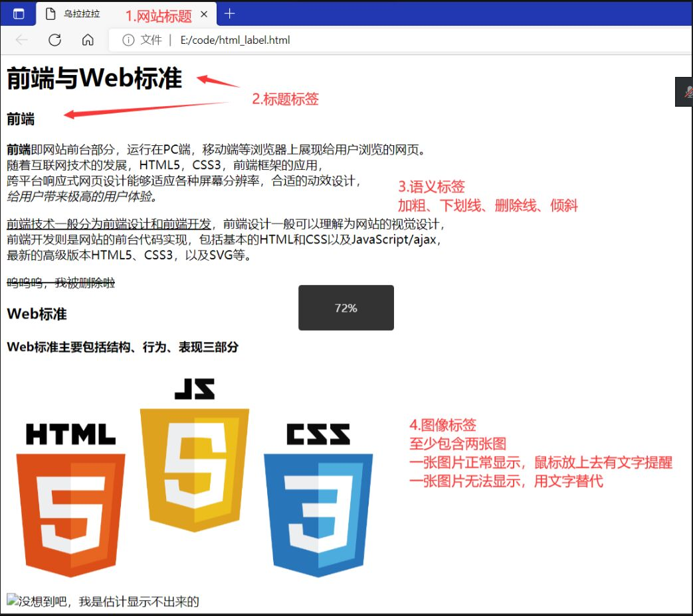

# 02_web_basic_and_html_a

主讲：李琦

谢谢网安部的lqgg喵，关注网安部谢谢喵

## 前言

哈喽！在开发部第二堂课，我们终于进入了主线内容！首先你将了解Web前后端的基本概念和原理，能知道在你打开[燕山大学官方网站](https://ys.mihoyo.com/)的过程中大概发生了什么。不过即使你不能完全明白也没关系，之后我们会逐层深入地为大家展开讲解🤗。

本次上课你只需要准备：

- Visual Studio Code：编写和调试HTML代码，后续的CSS和JavaScript也会用到。不过你也可以尝试JetBrains的WebStorm。

在此之后你可能需要继续安装某些插件来支持编写前端代码（也可能不需要）。（在遇到问题时我们鼓励STFW，当然你也可以在群中[提问](https://github.com/ryanhanwu/How-To-Ask-Questions-The-Smart-Way)）

### 参考

- VSCode安装教程：https://www.runoob.com/w3cnote/vscode-tutorial.html
- 前端入门基础教程：https://www.runoob.com/（也包含了C语言等许多其它内容）
- MDN：https://developer.mozilla.org/zh-CN/
- W3SCHOOL教程：https://www.w3school.com.cn/

仓库内也有以前的讲义供大家参考

## 课程主要内容

请参考第二次授课的讲义

## 作业

现在你学会HTML基础了，那么接下来我们就开始~~编写属于自己的燕山大学官网吧~~

编写一个HTML网页

### 作业要求

- 有自己的网站标题（浏览器标签页上）
- 使用分级的标题标签
- 使用加粗、下划线、删除线和倾斜标签
- 插入至少两张图片，其中一张能正常显示，另一张无法正常显示，用文字替代
- *STFW自学HTML表格的创建方式，并在你的作业中使用*

内容主题没有要求，请尽情发挥想象力

### 提交要求

我们仍然使用`git`进行作业提交，请你在`dev_tech`仓库下的`hw02_html_a`分支中**新建自己的文件夹**，在里面上传你的HTML代码文件和网页效果截图

提示：**请尽量在下次DDL（上课前）完成你的作业**

另外我们也可能在下节课上选出有创意的作品~~公开处刑~~向大家展示😋
