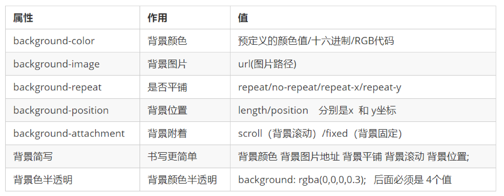
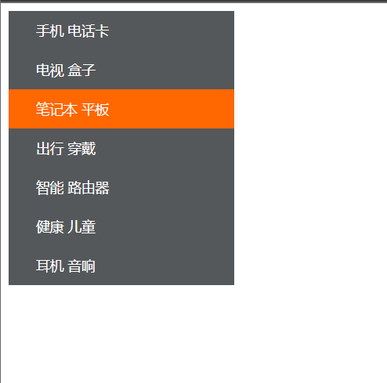

# 05_css_b


## 复习一下

### 什么是CSS
层叠样式表 ( Cascading Style Sheets )的缩写，同样是一种标记语言

### 为什么用CSS？
美化HTML，控制元素样式、页面布局


### 怎么用

#### 语法规范

选择器+属性声明s

分号、空格、代码风格...

使用`<style></style>`标签内嵌在HTML

或者`<link rel="stylesheet"  href="path/to/css">`外部链接

#### 使用基本的选择器指定对应的元素

```
    选择器{
​        属性：属性值;
​        ...
​    }
```

- 标签选择器
- 类选择器
- id选择器
- 通配符选择器


#### 字体和文本的CSS样式

- 字体、大小、粗细、...
- 文本颜色、对齐、...

---


## 复合选择器

### 后代选择器

后代选择器又称为包含选择器，可以选择父元素里面子元素。其写法就是把外层标签写在前面，内层标签写在后面，中间用空格分隔。当标签发生嵌套时，内层标签就成为外层标签的后代。

`元素1 元素2 {}`

- 元素1 和 元素2 中间用空格隔开
- 元素1 是父级，元素2 是子级，最终选择的是元素2
- 元素2 可以是儿子，也可以是孙子等，只要是元素1 的后代即可
- 元素1 和 元素2 可以是任意基础选择器

### 子选择器

子元素选择器（子选择器）只能选择作为某元素的最近一级子元素。

（简单理解就是选亲儿子元素）

`元素1 > 元素2 {}`

上述语法表示选择元素1 里面的所有直接后代(子元素) 元素2。

**语法说明**：

- 元素1 和 元素2 中间用 大于号 隔开
- 元素1 是父级，元素2 是子级，最终选择的是元素2
- 元素2 必须是亲儿子，其孙子、重孙之类都不归他管. 你也可以叫他 亲儿子选择器

### 并集选择器

并集选择器可以选择多组标签, 同时为他们定义相同的样式，通常用于集体声明。并集选择器是各选择器通过英文逗号（,）连接而成，任何形式的选择器都可以作为并集选择器的一部分。

`元素1, 元素2 {}`

- 元素1 和 元素2 中间用逗号隔开
- 逗号可以理解为和的意思
- 并集选择器通常用于集体声明

### 伪类选择器

伪类选择器用于向某些选择器添加特殊的效果，比如给链接添加特殊效果，或选择第1个，第n个元素。

### 示例


```html
<!DOCTYPE html>
<html lang="en">
<head>
    <meta charset="UTF-8">
    <meta name="viewport" content="width=device-width, initial-scale=1.0">
    <title>CSS Selectors Example</title>
    <style>
        /* 后代选择器：选择所有 p 元素内部的 span 元素 */
        .ul1 li {
            color: blue;
        }

        /* 子选择器：选择直接是 ul 子元素的 li 元素 */
        .ul2 > li {
            color: blue;
        }

        /* 并集选择器：选择所有 class 为 "highlight" 的元素和所有 h2 元素 */
        .highlight, h2 {
            background-color: yellow;
            padding: 5px;
        }

    </style>
</head>
<body>

<!-- 后代选择器 -->
<ul class="ul1">
    <li>Item 1</li>
    <li>Item 2</li>
    <li>Item 3</li>
    <span>
        <li>Item 4</li>
    </span>
</ul>

<!-- 子选择器 -->
<ul class="ul2">
    <li>Item 1</li>
    <li>Item 2</li>
    <li>Item 3</li>
    <span>
        <li>Item 4</li>
    </span>
</ul>

<!-- 并集选择器 -->
<div class="highlight">This is a highlighted div.</div>
<h2>This is an h2 heading.</h2>

</body>
</html>
```

- 后代选择器 .ul1 li： 选择所有 class 为 "ul1" 的元素内部的所有 <li> 元素，将这些 <li> 元素的文本颜色设置为蓝色。

- 子选择器 .ul2 > li： 选择所有 class 为 "ul2" 的元素内部直接子元素的所有 <li> 元素，将这些直接子元素的 <li> 元素的文本颜色设置为蓝色。

- 并集选择器 .highlight, h2：选择所有 class 为 "highlight" 的元素和所有 <h2> 元素，将这些元素的背景颜色设置为黄色，添加5px的内边距。


#### 例：链接伪类选择器

写一个链接的样式，使得链接未访问时（:link）为黑色；访问过（:visited）为橙色；鼠标经过时(:hover)为天蓝色；鼠标按住没弹起时(:active)绿色


```html
<!DOCTYPE html>
<html lang="en">

<head>
    <meta charset="UTF-8">
    <meta name="viewport" content="width=device-width, initial-scale=1.0">
    <meta http-equiv="X-UA-Compatible" content="ie=edge">
    <title>复合选择器之链接伪类选择器</title>
    <style>
        /* 1.未访问的链接 a:link  把没有点击过的(访问过的)链接选出来 */
        a:link {
            color: black;
        }

        /*2. a:visited 选择点击过的(访问过的)链接 */
        a:visited {
            color: orange;
        }

        /*3. a:hover 选择鼠标经过的那个链接 */
        a:hover {
            color: skyblue;
        }

        /* 4. a:active 选择的是我们鼠标正在按下还没有弹起鼠标的那个链接 */
        a:active {
            color: green;
        }
    </style>
</head>

<body>
    <a href="https://ys.mihoyo.com/?utm_source=backup53&from_channel=backup53&msclkid=277b4979366f141282692c18b1c87e56#/">Genshin Impact</a>
    <a href="http://www.xxxxxxxx.com">未知的网站</a>
</body>

</html>
```


## CSS元素分类和显示模式

### 1、什么是元素的显示模式

**定义：**

​		元素显示模式就是元素（标签）以什么方式进行显示，比如<div>自己占一行，比如一行可以放多个<span>。

**作用：**

​		网页的标签非常多，在不同地方会用到不同类型的标签，了解他们的特点可以更好的布局我们的网页。

### 2、元素显示模式的分类

#### 2.1、块元素

**常见的块元素**：

```
<h1>~<h6>、<p>、<div>、<ul>、<ol>、<li>
```

​		<div> 盒子标签是最典型的块元素。

**块级元素的特点**：

- 比较霸道，自己独占一行。
- 高度，宽度、外边距以及内边距都可以控制。
- 宽度默认是容器（父级宽度）的100%。
- 是一个容器及盒子，里面可以放行内或者块级元素。


**注意：**

​		文字类的元素内不能放块级元素

```
<p> 标签主要用于存放文字，因此 <p> 里面不能放块级元素，特别是不能放<div> 
同理， <h1>~<h6>等都是文字类块级标签，里面也不能放其他块级元素
```

示例代码：
```html
<!DOCTYPE html>
<html lang="en">

<head>
    <meta charset="UTF-8">
    <meta name="viewport" content="width=device-width, initial-scale=1.0">
    <meta http-equiv="X-UA-Compatible" content="ie=edge">
    <title>显示模式之块级元素</title>
    <style>
        div {
            /* width: 200px; */
            height: 200px;
            background-color: pink;
        }
    </style>
</head>

<body>
    <div>比较霸道,自己独占一行</div> 瑟瑟发抖
    <p>
        <div>这里有问题</div>
    </p>
</body>

</html>
```

#### 2.2、行内元素

**常见的行内元素：**

```
<a>、<strong>、<b>、<em>、<i>、<del>、<s>、<ins>、<u>、<span>
```

​		<span> 标签是最典型的行内元素。有的地方也将行内元素称为内联元素。


**行内元素的特点：**

- 相邻行内元素在一行上，一行可以显示多个。

- 高、宽直接设置是无效的。

- 默认宽度就是它本身内容的宽度。

- 行内元素只能容纳文本或其他行内元素。


**注意：**
		链接里面不能再放链接
		特殊情况链接 <a> 里面可以放块级元素，但是给 <a> 转换一下块级模式最安全

示例代码：
```html
<!DOCTYPE html>
<html lang="en">

<head>
    <meta charset="UTF-8">
    <meta name="viewport" content="width=device-width, initial-scale=1.0">
    <meta http-equiv="X-UA-Compatible" content="ie=edge">
    <title>显示模式之行内元素</title>
    <style>
        span {
            width: 100px;
            height: 100px;
            background-color: hotpink;
        }
    </style>
</head>

<body>
    <span>啊叭叭叭叭叭叭叭叭叭</span> <strong>啊叭叭叭叭啊啊啊啊叭叭叭</strong>
    <span>哼哼</span> <strong>啊啊啊啊啊啊啊</strong>

    <a href="http://www.baidu.com">
        <a href=""></a>
    </a>
</body>

</html>
```

#### 2.3、行内块元素

**常见的行内块标签**：

```
、<input />、<td>
```

​		它们同时具有块元素和行内元素的特点。有些资料称它们为行内块元素。

**行内块元素的特点**：

- 和相邻行内元素（行内块）在一行上，但是他们之间会有空白缝隙。
- 一行可以显示多个（行内元素特点）。
- 默认宽度就是它本身内容的宽度（行内元素特点）。
- 高度，行高、外边距以及内边距都可以控制（块级元素特点）。

示例代码：
```html
<!DOCTYPE html>
<html lang="en">

<head>
    <meta charset="UTF-8">
    <meta name="viewport" content="width=device-width, initial-scale=1.0">
    <meta http-equiv="X-UA-Compatible" content="ie=edge">
    <title>显示模式之行内块元素(特殊情况)</title>
    <style>
        input {
            width: 249px;
            height: 35px;
        }
    </style>
</head>

<body>
    <input type="text">
    <input type="text">
</body>

</html>
```

### 3、元素显示模式的转换

**简单理解**: 

​		一个模式的元素需要另外一种模式的特性
​		比如想要增加链接 <a> 的触发范围。

**转换方式**

- 转换为块元素：display:block;
- 转换为行内元素：display:inline;
- 转换为行内块：display: inline-block;


示例代码：
```html

<!DOCTYPE html>
<html lang="en">

<head>
    <meta charset="UTF-8">
    <meta name="viewport" content="width=device-width, initial-scale=1.0">
    <meta http-equiv="X-UA-Compatible" content="ie=edge">
    <title>元素显示模式转换</title>
    <style>
        a {
            width: 150px;
            height: 50px;
            background-color: pink;
            /* 把行内元素 a 转换为 块级元素 */
            display: block;
        }

        div {
            width: 300px;
            height: 100px;
            background-color: purple;
            /* 把 div 块级元素转换为行内元素 */
            display: inline;
        }

        span {
            width: 300px;
            height: 30px;
            background-color: skyblue;
            display: inline-block;
        }
    </style>
</head>

<body>
    <a href="#">你好</a>
    <a href="#">你好</a>
    <div>我是块级元素</div>
    <div>我是块级元素</div>
    <span>行内元素转换为行内块元素</span>
    <span>行内元素转换为行内块元素</span>
</body>

</html>
```


## 背景样式
通过 CSS 背景属性，可以给页面元素添加背景样式。
背景属性可以设置背景颜色、背景图片、背景平铺、背景图片位置、背景图像固定等。




### 例：背景图片

```html
<!DOCTYPE html>
<html lang="en">
<head>
    <meta charset="UTF-8">
    <meta name="viewport" content="width=device-width, initial-scale=1.0">
    <title>Background Image Example</title>
    <style>
        body {
            margin: 0;
            padding: 0;
            background: url('/path/to/your/img') no-repeat center center fixed; /* 替换 '/path/to/your/img' 为你的图片路径 */
            background-size: cover;
            height: 100vh;
            display: flex;
            align-items: center;
            justify-content: center;
        }

        /* 如果需要在背景图片上放置内容，可以使用透明的容器 */
        .content {
            background-color: rgba(0, 0, 0, 0.5); /* 半透明黑色背景，用于提高文本可读性 */
            padding: 20px;
            border-radius: 10px;
            text-align: center;
            color: #fff; /* 设置文本颜色，以确保在背景图片上能够看清文本 */
        }
    </style>
</head>
<body>
    <div class="content">
        <h1>你好</h1>
        <p>你好你好你好你好你好你好你好你好你好你好</p>
    </div>
</body>
</html>
```


### 例：小米主题色侧边栏



提示：a链接标签原本是inline行内元素，默认只会横向排布

```html
<!DOCTYPE html>
<html lang="en">

<head>
    <meta charset="UTF-8">
    <meta name="viewport" content="width=device-width, initial-scale=1.0">
    <meta http-equiv="X-UA-Compatible" content="ie=edge">
    <title>简单版小米侧边栏</title>
    <style>
        /* 1. 把a转换为块级元素 */
        a {
            display: block;
            width: 230px;
            height: 40px;
            background-color: #55585a;
            font-size: 14px;
            color: #fff;
            text-decoration: none;
            text-indent: 2em;
            line-height: 40px;
        }

        /* 2 鼠标经过链接变换背景颜色 */
        a:hover {
            background-color: #ff6700;
        }
    </style>
</head>

<body>
    <a href="#">手机 电话卡</a>
    <a href="#">电视 盒子</a>
    <a href="#">笔记本 平板</a>
    <a href="#">出行 穿戴</a>
    <a href="#">智能 路由器</a>
    <a href="#">健康 儿童</a>
    <a href="#">耳机 音响</a>
</body>
</html>
```


## 布局

详见参考资料day4 day6

传统的三种布局方式：

- 标准流
- 定位
- 浮动
