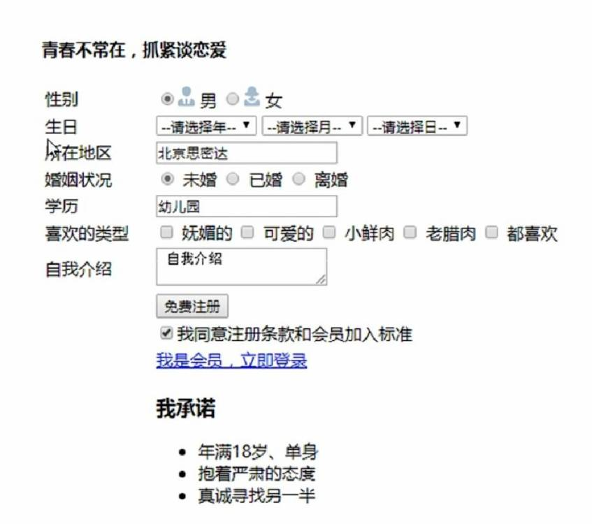

# 开发部第三次作业 - 青春不常在，抓紧谈恋爱

「我的世界一直都很暗淡，后来你来了，带着星星和月亮。」

## 作业要求

编写一个恋爱交友网站的信息登记页面

- 尽情使用你学习过的HTML元素（单选按钮、文本框等等）

可参考样例：

## 思考

通过搜索互联网，尝试解决下面的问题

- 生日选项的年月日三个下拉选项太麻烦了，能否实现像日历一样直接点击选择某个日期？
- 如果想让这些元素在页面居中，如何实现？
- 怎样给网页设置一个铺满全屏的背景图片？
- ...

## 提交要求

我们仍然使用`git`进行作业提交，请你在此分支(hw03_html_b)中**新建自己的文件夹**，在里面上传你的HTML代码文件

### 注：之前fork的仓库中没有hw03_html_b分支，我该怎么办

如果你使用GitHub网页进行操作，请删除之前fork的仓库，重新fork，并注意**取消勾选**仅复刻main分支的选项

如果你使用命令行操作，请参考[这里](https://docs.github.com/zh/pull-requests/collaborating-with-pull-requests/working-with-forks/syncing-a-fork?platform=windows)，或者自行搜索互联网尝试解决

